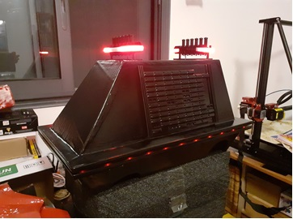

# Mouse Droid MSE-6 StarWars

En collaboration avec l'association [Les Voyageur Des Etoiles] nous avons réalisé une réplique du **Mouse Droid MSE-6** de **StarWars** :

 

*Conçu et produit par Rebaxan Columni pour le compte de l'Empire. De petite taille (moins de 30cm de hauteur), il est muni de quatres roues. Ce modèle est utilisé pour les tâches de maintenance simples et pour le nettoyage des sols.*

L'objectif du projet est d'avoir un robot pilotable par Smartphone permettant d'accompagner les acteurs dans leurs déambulations lors de salons ou d'animations.

Ce robot doit également avoir une fonction "Autonome" lui permettant de déambuler seul dans un endroit clos en évitant les obstables.

* Dimension à l'échelle 1
* Modes de fonctionnement
    * Pilotage en BlueTooth sur Android
    * Mode autonome aléatoire avec detection d'obstacles
    * Ne doit pas être très rapide car déplacement dans la foule
* Sur batterie avec une autonomie d'au moins 20 minutes
* Eclairage d'ambiance par ruban à LED
* Bruitage sonore MP3 tirés du film

# Dimensions
Plan issu du site http://luckyxero.com/droids/mouse-droid-build/ *(dimensions en inches)*

# Construction

La coque a été fabriquée avec :
*  du carton-plume de XX cm d'épaisseur,
* colle .....
* recouvert de plusieurs couches de vernis epoxy
* Peinture noir ......
* Décoration sur le dessus : http://www.thingiverse.com/thing:1862673
* Décoration sur les côtés : ........

# Pilotage par Smartphone

Télécharger l'application Android [apk]

# 
*[Nao974] v1.0 2024-01*

[FICHES]: ./FICHES
[apk]: ./android_apk/MouseDroid_MSE6.apk

[Robotic974]:      https://www.facebook.com/robotic974
[Nao974]:          https://www.youtube.com/@Nao974Robotic
[Les Voyageur Des Etoiles]: https://www.facebook.com/LesVDE
[Images de référence] :     https://photos.google.com/share/AF1QipP5TdWiDbklsdGn5iPU7iJ0s8NH2A8It0JS8Ncwk7ek5rMM8T10t8TtdKYRnrsGPw?key=UlJRWnE1RnF6UjMwVTlsbGtKWFJwVks3Ym56S0p3